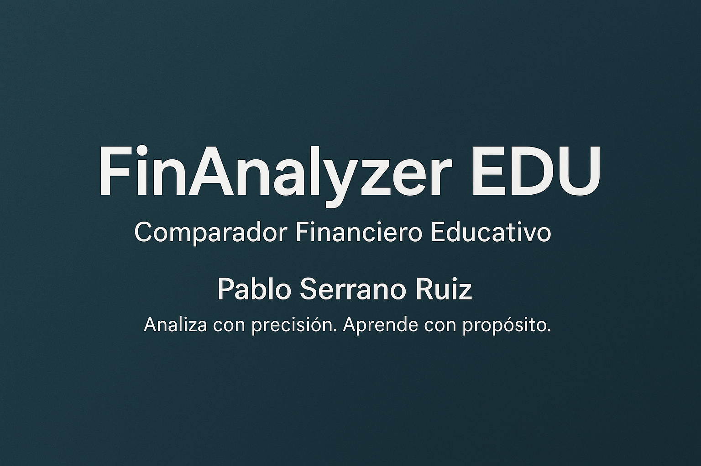

# 📊 FinAnalyzer EDU — Comparador Financiero Educativo

FinAnalyzer EDU es una aplicación interactiva creada con fines pedagógicos, que permite analizar activos bursátiles mediante indicadores técnicos y visualización gráfica.

---

## 🎯 ¿Qué incluye?

- ✅ Comparación de múltiples activos financieros
- ✅ Análisis técnico: RSI, MACD, Bandas de Bollinger, SMA/EMA
- ✅ Explicaciones educativas debajo de cada gráfico
- ✅ Exportación de datos en CSV
- ✅ Tema Claro/Oscuro
- ✅ Firma institucional y propósito docente

---

## 🚀 Acceso online

👉 App pública: [finanalyzeredu.streamlit.app](https://pablo-lab104-finanalyzeredu-comparador-financierov5-3x9d96.streamlit.app)

---

## 👨‍🏫 Autor

**Pablo Serrano Ruiz**  
*Analiza con precisión. Aprende con propósito.*  
